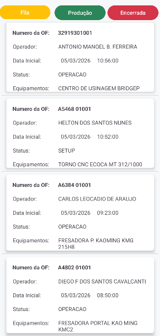

# 📱 LeanMobile - Monitoramento de Fábrica via Android

O **LeanMobile** é o braço móvel do ecossistema LeanMonitor. Desenvolvido em **Kotlin**, este aplicativo permite que gestores e supervisores acompanhem, em tempo real, o status de cada máquina (Operação, Setup ou Parada) e a Ordem de Fabricação (OF) atual, diretamente de um dispositivo Android.

---

## 📸 Interface do Aplicativo

  

## ✨ Funcionalidades Mobile
- [x] **Dashboard Mobile:** Visualização resumida de todas as máquinas da linha.
- [x] **Status em Tempo Real:** Atualização dinâmica via integração com a API Flask.
- [x] **Alertas de Parada:** Notificações ou destaques visuais quando uma máquina entra em estado de "PARADA".
- [x] **Detalhes da OF:** Consulta rápida sobre qual Ordem de Fabricação está vinculada a cada equipamento.

## 🛠️ Tecnologias Utilizadas
- **Linguagem:** [Kotlin](https://kotlinlang.org/)
- **Plataforma:** Android Nativo
- **Consumo de API:** [Retrofit](https://square.github.io/retrofit/) ou [Volley](https://developer.android.com/training/volley) (para conectar ao backend Flask)
- **Interface:** XML / Jetpack Compose
- **Arquitetura:** MVVM (Model-View-ViewModel)

🔌 Integração do Ecossistema
Este aplicativo faz parte de uma solução maior:

Arduino: Coleta os dados físicos.

Flask + SQL Server: Processa e armazena as informações.

Android (Este App): Exibe os dados para tomada de decisão rápida.

👩‍💻 Autora
Luana Julia 
